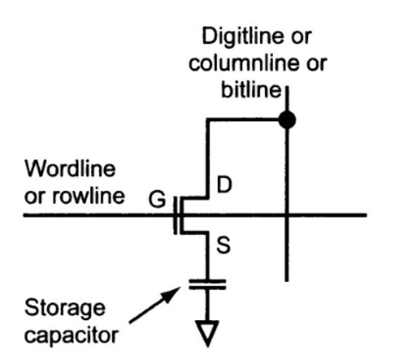
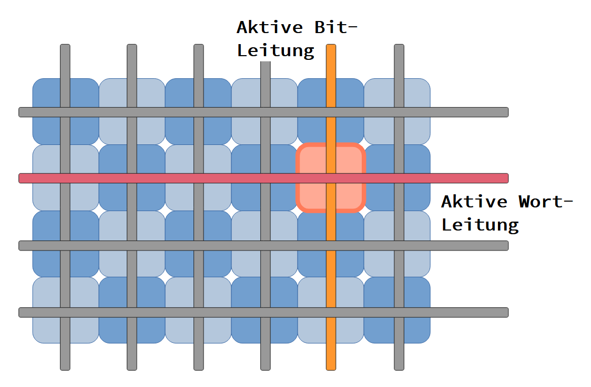
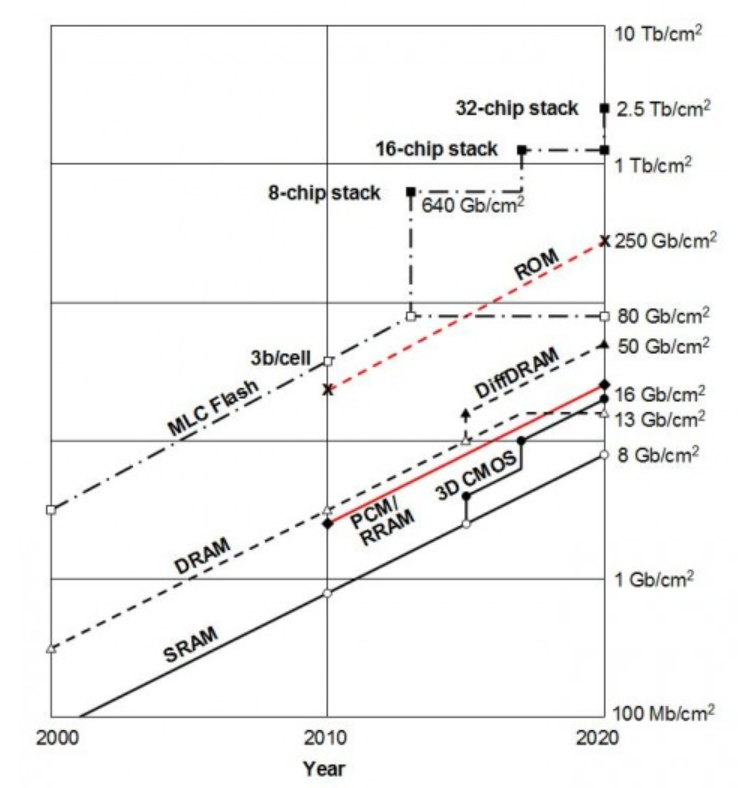
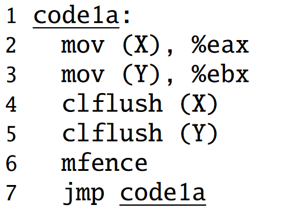
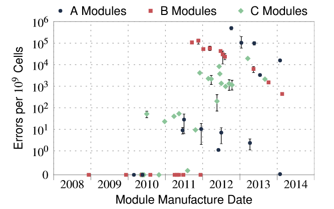
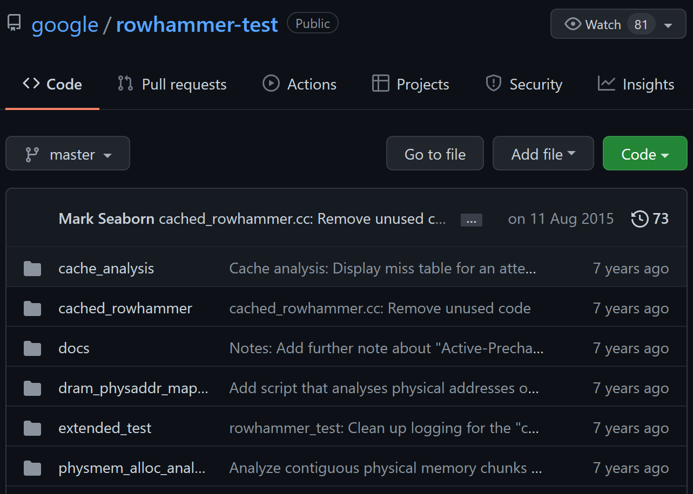

# Rowhammer-Theorie

### Grundlagen

#### Der Speicher als Fehler

Die Schwäche heutiger Speichersysteme gegenüber potentiellen Rowhammer-Angriffen liegt  in der Natur des DRAM-Speichers selbst. Die Speicherzellen **sind** der Fehler im System.

##### Dynamic Random Acsess Memory - DRAM

DRAM hat viele Vorteile. Er ist schnell, kostet wenig und bleibt dabei konzeptionell eigentlich simpel. Das gilt nicht für die Herstellung, allerdings reicht uns hier eine grobe Idee, der Architektur. [[1]](#1)

Um die Probleme der Speicherbausteine gegen Rowhammer-Angriffe zu verstehen, betrachten wir nachfolgend den theoretischen Aufbau solcher Zellen.

DRAM-Bits bestehen prinzipiell nur aus einem Transistor und einem Kondensator (Capacitor), der Information speichert (Siehe Bild). 

Abb. 1 [[1]](#1) Bild aus DRAM Circuit Design S. 10 Fig, 1.12

DRAM ist als eine Matrix von Bits aufgebaut (Abb2). Jedes Bit in dieser Speichermatrix wird über eine sogenannte Wort-Leitung und eine Bit-Leitung adressiert - auch Row und Column genannt. 

Wenn zum Beispiel in ein Bit geschrieben werden soll, muss die Wordline nur Spannung auf den Gate-Anschluss (Abb1 G) des Transistors geben. Damit wird eine leitende Verbindung von Drain- (Abb1 D) zu Source-Gebieten (Abb1 S) hergestellt und der Kondensator kann über die Bit-Leitung geladen werden. Ganz ähnlich wird auch aus den Kondensatoren gelesen, auf eine genaue Erklärung zur Funktion von D-RAM Bits verzichten wir hier aber. 

Bereits die kleinsten Bausteine enthalten über 1000 Speicherzellen in einer Matrix. In Abbildung zwei wird ein Zugriff in einer solchen Matrix vereinfacht dargestellt.

Abbildung 2 vereinfachte Matrix-Darstellung der Bits 

##### Das Problem mit der Grösse

DRAM kann extrem kompakt hergestellt werden. Eine Grafik aus dem 2012 veröffentlichten Buch "CHIPS 2020" zeigt, das der durchscnittliche DRAM-Baustein schon vor Jahren aus Billionen von Bits je Quadratzentimeter bestand. [[3]](#3) Das erlaubt Speicherzugriffe im Nanosekundenbereich. 

Abbildung 3 *Evolution of CMOS memory density for SRAM, DRAM and Flash memory.* Aus CHIPS 2020 [[2]](#2)  [[3]](#3)

Allerdings bringen Chips mit dieser nur schwer vorstellbaren Kompaktheit und geradezu irren Geschwindigkeit ihre eigenen Herausforderungen mit sich. Kurz: Es gibt auch Fehlerhafte Bits. 

Diese machen zwar den Chip nicht unbrauchbar, können aber zum Beispiel kleine Lecks verursachen, die andere Bits in direkter Nachbarschaft beinflussen. Im Prinzip können Bits so Ladung austauschen, obwohl sie eigentlich voneinander isoliert sein sollten. Und da kommen wir endlich zur Krux: Denn genau diese "schwachen" Bits versucht Rowhammer auszunutzen.  [[4]](#4)

#### Row-Hammer

##### Die Idee

Das Prinzip von Rowhammer ist äusserst einfach. Schwache Bits im Speicher sollen gezielt ausgenutzt werden. Über **schnelle Speicherzugriffe des immer selben Speicherbereichs**, wird im Nanosekundenbereich wieder und wieder die gleiche Wort-Leitung (Row) unter Spannung gesetzt. Das Programm "hämmert" sozusagen auf eine Reihe ein. Daher der Name *Row-Hammer*.

Durch dieses Hämmern erhöht sich die Chance, das ein "schwaches" Bit nachgibt und ein Leck verursacht deutlich.[[4]](#4) Im schlimmsten Fall löst das entsprechende Bit, dann einen Statuswechsel in einer anderen Reihe aus. Oder ganz direkt formuliert: Das Leck könnte in einemnaheliegenden Bit eine 0 zu einer 1 machen.

##### Code

Der für das reine "hämmern" nötige Code beschränkt sich für gängige Prozessoren auf ein paar Zeilen x86-Assembler.

Abbildung 4  Beispiel aus *Flipping Bits in Memory Without Accessing Them:  
An Experimental Study of DRAM Disturbance Errors* [[5]](#5)

In Zeile 1 und 2 werden Registerinhalte in Reihe X und Y gespeichert. Gleich darauf löscht (invalidiert) das Programm in Zeile 4 und 5 die Reihen wieder[[6]](#6) und stellt mit mfence in Zeile 6 sicher,  dass die Speicherzugriffe in der richtigen Reihenfolge ablaufen. In Zeile 7 wird das Programm rekursiv aufgerufen. 

Damit lassen sich Schwachstellen zwar noch nicht gezielt ausnutzen, ein Testprogramm von Google [[0]](#0) kommt aber zum Beispiel bereits mit einigen hundert Zeilen Code aus. Aktuelle Systeme lassen sich nicht ganz so einfach austricksen. Wichtig ist uns hier zu zeigen, dass Rowhammer auf einem sehr einfachen Level agiert. 

Abbildung 5 *RowHammer error rate vs. manufacturing dates of 129  
DRAM modules we tested.* Aus RowHammer: a Retrospektive [[4]](#4) (Die Namen der Hersteller wurden anonymisiert)

Abbildung 4 zeigt elementar, dass die Anzahl der anfälligen Bits in Speicherblöcken bis etwa 2012 immer weiter zugenommen hat. Je näher die Bits also zusammenliegen, umso anfälliger sind sie für Row-Hammering. Den Abwärtstrend in späteren Jahren thematisieren wir in einem der nachfolgenden Kapitel. 

...

...

...

##### Rowhammer at Home

Google hat einen Row-Hammer-Test für x86-Computer als Open-Source-Projekt veröffentlicht. Der Test funktioniert allerdings nur mit älteren Ram-Riegeln (DDR3).[[0]](#0)

[[1]](#1)

id="1">[1] Referenz 1[DRAM Circuit Design: Fundamental and High-Speed Topics - Brent Keeth, R. Jacob Baker, Brian Johnson, Feng Lin - Google Books](https://books.google.de/books?id=TgW3LTubREQC&pg=PA33&hl=de&source=gbs_toc_r&cad=3#v=onepage&q&f=false)

[[2]](#2)
id="2">[2] Referenz 2[Towards Terabit Memories | Chips 2020](https://www.chips2020.net/chapter/towards-terabit-memories)

id="3">[3] Referenz 3  [[Chips 2020 | SpringerLink](https://link.springer.com/book/10.1007/978-3-642-23096-7)]

id="4">[4] Referenz 4 [[[1904.09724] RowHammer: A Retrospective](https://arxiv.org/abs/1904.09724)]

id="5">[5] Referenz 5 [[Flipping bits in memory without accessing them: An experimental study of DRAM disturbance errors | IEEE Conference Publication | IEEE Xplore](https://ieeexplore.ieee.org/document/6853210)]

id="6">[6] Referenz 6 [Into the Void: x86 Instruction Set Reference](https://c9x.me/x86/html/file_module_x86_id_30.html)

id="0">[0] Referenz 0 [GitHub - google/rowhammer-test: Test DRAM for bit flips caused by the rowhammer problem](https://github.com/google/rowhammer-test)

